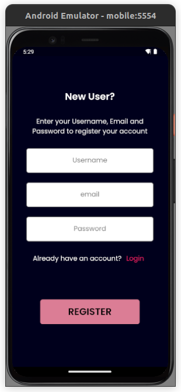
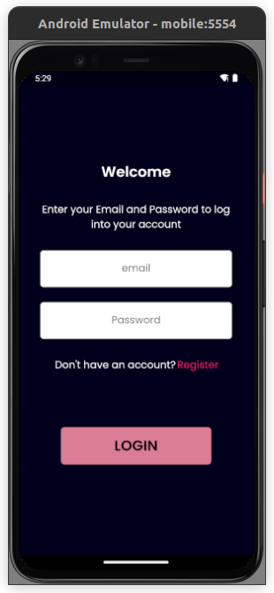
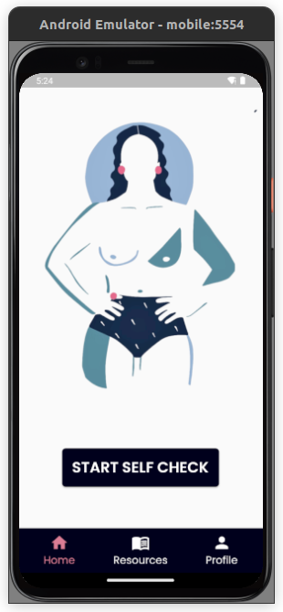
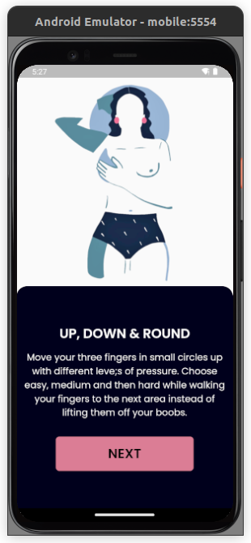
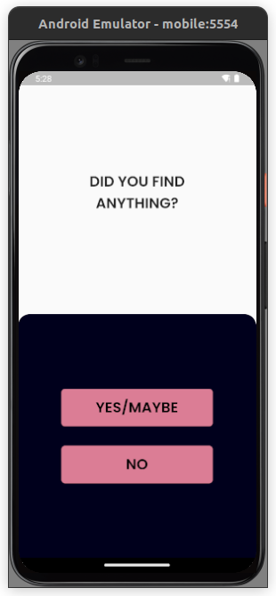
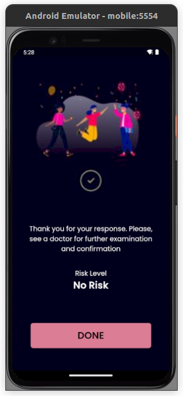
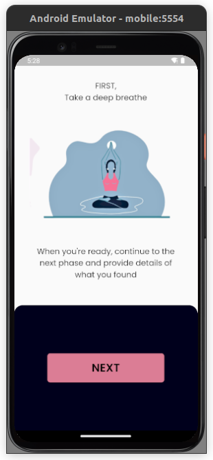
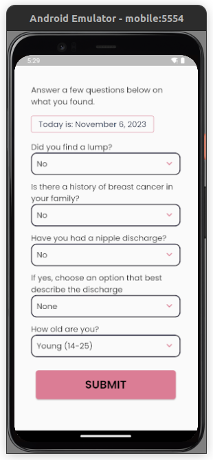
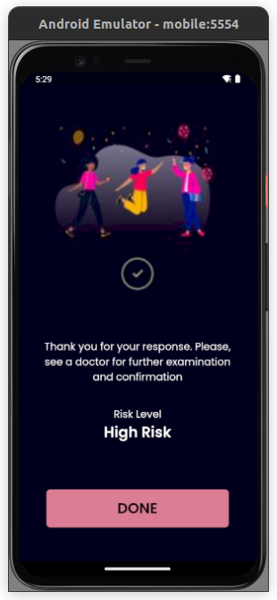

# Breastcancerapp

A project built for detection of Breast Cancer through self examination - by [Oriohac](https//www.x.com/oriohac).

## Getting Started

The user signs up and goes through the self examination processes, by reading through instructions on each page and practicing all that is written on those pages.

   

## Result

After the self check, the user determines if any of the symptoms is present in their breast, if there is none, the user is shown that they are in the no risk category and advised to see a doctor.

 

If the user finds some symptoms, they are taken to a form where they input some of the symptoms found and the final output shows whether their risk level is high, low or np risk level.

   
